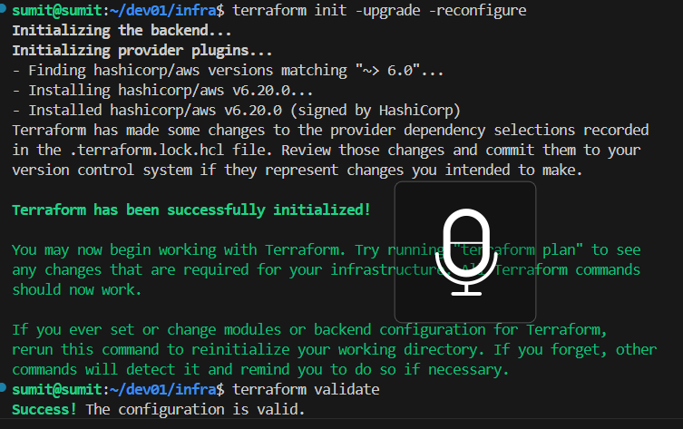
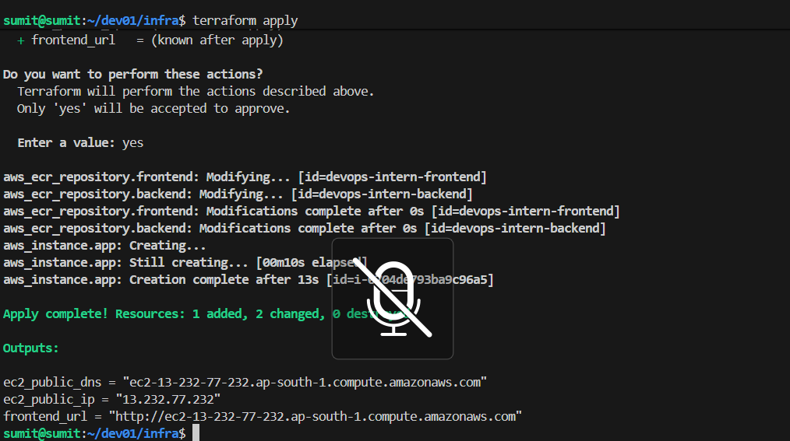
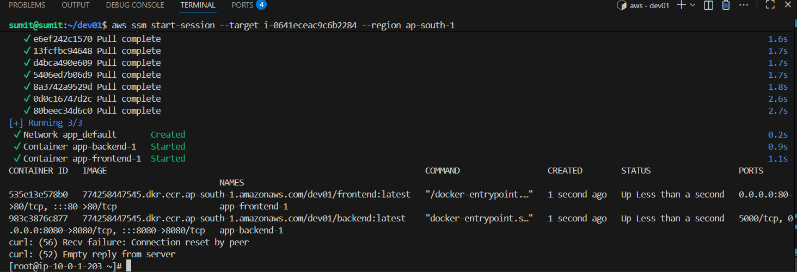
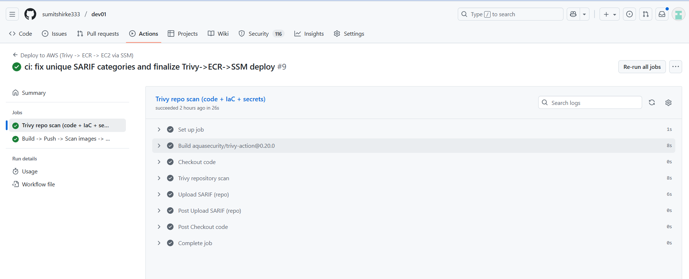
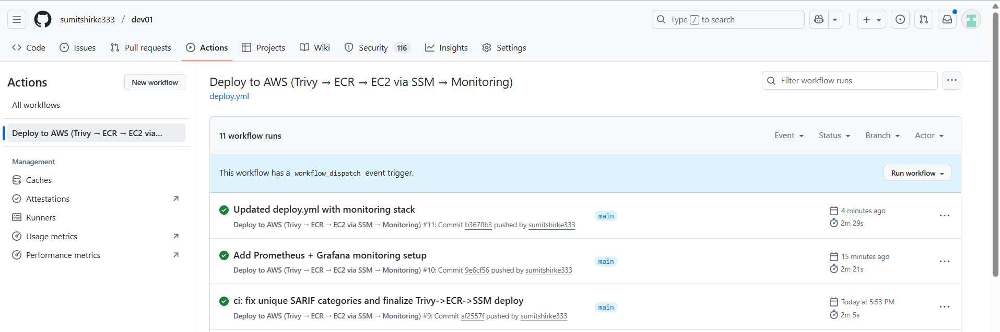
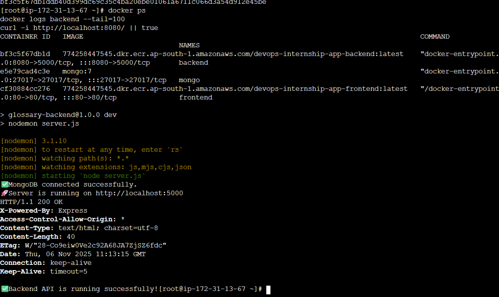
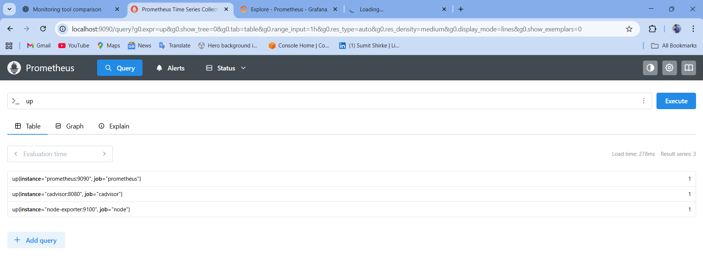
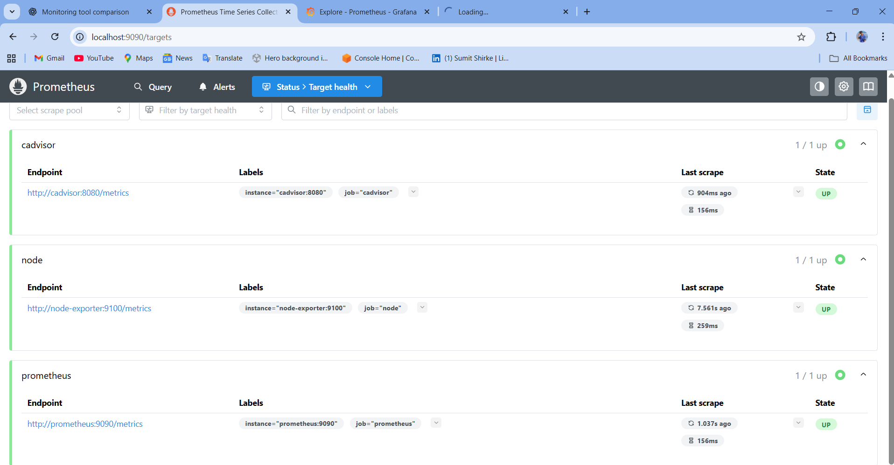
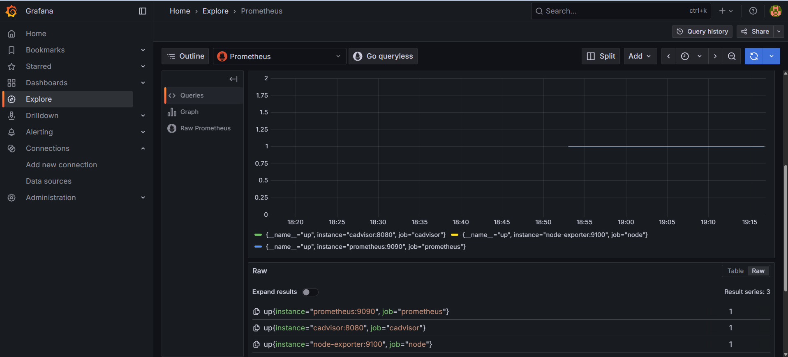
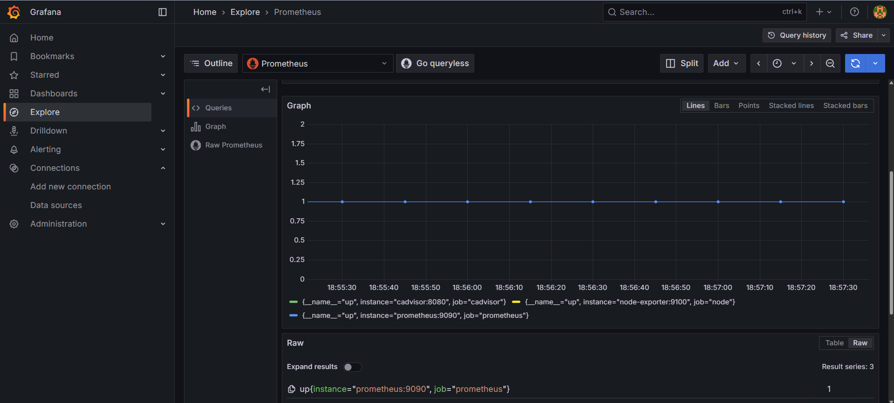

# DevOps Internship Project – AWS EC2 | ECR | SSM | Terraform | GitHub Actions | Monitoring


This repository contains a full end-to-end **DevOps deployment project**, where a React + Node.js + MongoDB application is deployed on **AWS**, using **EC2**, **ECR**, **SSM**, **Terraform**, **Docker**, **GitHub Actions CI/CD**, **Prometheus**, and **Grafana**.

This README is commit-ready and includes real screenshot paths, clear setup instructions, architecture, CI/CD flow, and monitoring sections.

---

## 🚀 Project Overview

This DevOps project demonstrates:

* Containerising a full‑stack web application
* Pushing images to **Amazon ECR**
* Deploying the application on **EC2** using Docker Compose
* Managing the EC2 instance using **AWS Systems Manager (SSM)** (no SSH)
* Provisioning AWS infrastructure with **Terraform**
* Building CI/CD pipelines with **GitHub Actions**
* Implementing **security scanning (Trivy)** in pipelines
* **Monitoring** the application with **Prometheus + Grafana**

---

## 📁 Repository Structure

```
dev01/
├── .github/workflows/           # CI/CD pipeline definitions
├── app/
│   ├── frontend/                # React app
│   └── backend/                 # Node.js + MongoDB API
├── infra/                       # Terraform infrastructure
├── monitoring/                  # Prometheus + Grafana configs
├── scripts/                     # Deployment and helper scripts
├── screenshots/                 # Screenshots added for README
├── videos/                      # Demo videos
├── docker-compose.yml           # Runs containers locally + on EC2
└── ISSUES.md                    # Issue log and fixes
```

---

## 🧭 Architecture

```
           GitHub Actions
        ┌──────────────────┐
        │ build / scan /   │
        │ push to ECR      │
        └───────┬──────────┘
                │
                ▼
        ┌──────────────────┐
        │   Amazon ECR     │
        └───────┬──────────┘
                │ pull
                ▼
        ┌──────────────────┐    Metrics    ┌────────────────┐
        │   AWS EC2        │──────────────▶│  Prometheus    │
        │ (Docker Compose) │               └────────────────┘
        └──────────────────┘                       │
                │                                   ▼
                │                              ┌──────────┐
                └─────────────────────────────▶│ Grafana  │
                                               └──────────┘
```

---

## ⚙️ Tech Stack

* **React** – Frontend
* **Node.js + Express** – Backend
* **MongoDB** – Database
* **Docker & Docker Compose** – Containerisation
* **AWS EC2, ECR, SSM** – Deployment & Ops
* **Terraform** – Infrastructure as Code
* **GitHub Actions** – CI/CD pipeline
* **Prometheus & Grafana** – Monitoring stack
* **Trivy** – Security scanning

---

## 🧪 Running Locally

```bash
git clone https://github.com/sumitshirke333/dev01.git
cd dev01
docker compose up --build
```
---

## ☁️ Deploying to AWS with Terraform

### 1️⃣ Configure AWS CLI

```bash
aws configure
# Region → ap-south-1
```

### 2️⃣ Deploy Infra

```bash
cd infra
terraform init
terraform apply
```

### 3️⃣ Connect to EC2 via SSM (no SSH)

```bash
aws ssm start-session --target <EC2-ID>
```

### 4️⃣ Pull & Run Containers

```bash
docker compose pull
docker compose up -d
```

---

## 🔁 CI/CD Pipeline – GitHub Actions

Your pipeline performs:

1. Checkout code
2. Configure AWS login (OIDC or secrets)
3. Build Docker images
4. Run **Trivy security scans**
5. Push images to **Amazon ECR**
6. Trigger EC2 deployment via SSM

Pipeline files are located in:

```
.github/workflows/
```

---

## 🔒 Security

* No hardcoded secrets
* AWS keys stored in GitHub Secrets
* Scanning enabled using **Trivy**

---

## 📊 Monitoring (Prometheus + Grafana)

* Prometheus scrapes backend + node metrics
* Grafana displays dashboards:

  * CPU/Memory Usage
  * Container metrics
  * Request latency & errors
  * MongoDB and API insights

---

## 📸 Screenshots & Demo

Below are the actual screenshot and video assets added for this project.

### 📷 Screenshots













### 🎥 Demo Video

https://github.com/user-attachments/assets/c6d3c210-d4f5-42fb-8e72-83b1dea629d4

---

## 🛠 Troubleshooting

A detailed RCA log is maintained in:

```
ISSUES.md
```

Add your final **TROUBLESHOOTING.md** for submission.

---

## 🧾 Author

**Sumit Shirke**
GitHub: [sumitshirke333](https://github.com/sumitshirke333)

---

## 📜 License

Open-source for learning & DevOps portfolio use.
